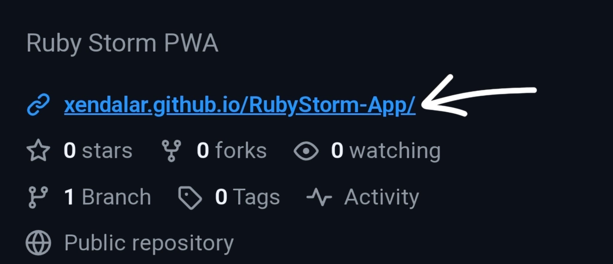

# ⚡ Ruby Storm — MTG Game Assistant

¡Hola!
Soy Xendalar, Alfredo para los que me conocen.

Cuando empecé a jugar Ruby Storm vi un problema: llevar la cuenta de las cosas con dados es un enorme peñazo porque en cualquier momento les das un golpe y ahora vete tú a saber por cuánto iba la cuenta. Normalmente no es tan complicado, pero puede pasar que no haya acuerdo o que simplemente los jugadores no recuerden.
Llevar las cuentas a papel es otra opción y más segura, pero a veces no quieres cargar con un libreta y boli o te da pereza y ya está.

Pues ea, para eso hice esta app. Llevo poco programando pero si tienes la capacidad, ¿por qué no? Igual que si eres panadero no vas a comprarle el pan al de al lado (o sí, no me meto en la vida interna de los panaderos), pues siendo programador si tienes un problema que se puede resolver con una app, lo más cómodo es sentarte y hacerla a tu medida. Como no había nada similar, o no he encontrado nada similar, aquí estamos.

---

## Description

A mobile web app (PWA) designed as a game assistant for Storm decks in Magic: The Gathering's **Modern** format. Designed especially for **Ruby Storm**, but configurable for any Storm variant.

Available in **Spanish and English**.

---

## Features

- **Ral coin flip** — tap to flip and track heads/tails streaks
- **Storm Count** — separate counters for Storm (all spells, for Grapeshot) and Ral (instants/sorceries only, for his loyalty)
- **Mana tracker** — red mana by default, add any of the five colors as needed
- **Configurable** — hide the coin flip and Ral counter if you're playing a different Storm deck
- Installable as a home screen app on Android and iOS (no app store needed)

---

## Configuration

Tap the **gear icon** (top left) to open Settings. From there you can toggle:

- **Ral Coin Flip** — show or hide the coin flip section. Turn off if your deck doesn't use Ral, Monsoon Mage.
- **Ral Counter** — show or hide the Ral spell counter in Storm Count. Turn off if you only need the total Storm count.

Your preferences are saved automatically and persist between sessions.

Tap the **? icon** (top left) for a brief description of the app and its features.

---

## How to install

Open **[xendalar.github.io/RubyStorm-App](https://xendalar.github.io/RubyStorm-App/)** in your mobile browser and follow the steps below.

### Android (Chrome)

Chrome will prompt you to install automatically when you open the link. If it doesn't appear:

1. Tap the **three-dot menu** (top right)
2. Select **"Add to Home screen"**
3. Confirm by tapping **"Add"**

### iOS (Safari)

1. Open the link in **Safari** (not Chrome)
2. Tap the **Share button** — the square with an arrow at the bottom of the screen
3. Select **"Add to Home Screen"**
4. Confirm by tapping **"Add"**

The app will appear on your home screen and open full-screen, just like a native app.

---

## Files

| File | Description |
|---|---|
| `index.html` | Main app |
| `manifest.json` | PWA manifest (name, icons, colors) |
| `sw.js` | Service worker (offline support) |
| `icons/` | App icons in multiple sizes |

---

## Support

If you find this useful, you can support development on [Ko-fi](https://ko-fi.com/xendalar).

---

*Not affiliated with Wizards of the Coast. Magic: The Gathering is property of Wizards of the Coast LLC.*
